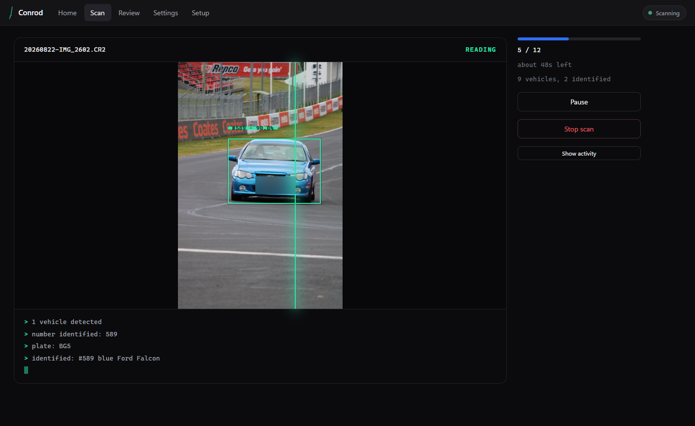
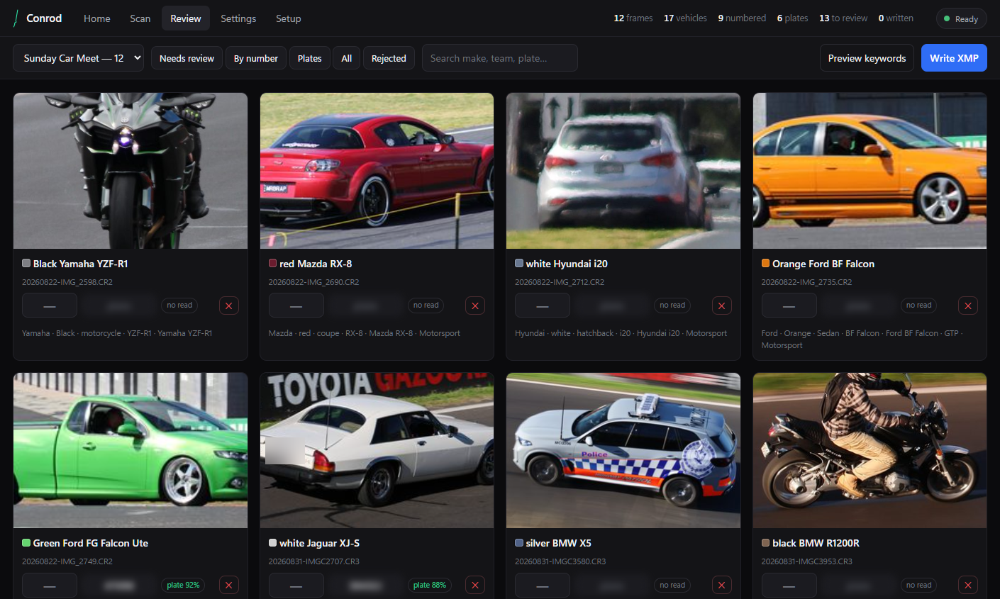

# Conrod

Vehicle keywording for motorsport and car photography, running on your own
machine. Point it at a folder of frames; it finds the cars and bikes, reads
competition numbers, registration plates and livery text, works out make, model
and colour, and writes the lot into XMP where Lightroom, Bridge, Photo Mechanic
and Capture One will see it.

Named for Conrod Straight at Mount Panorama, which is also what the mark is.

## What it looks like

A scan in progress. Each frame is shown as it is read, with the vehicles it
found boxed on it, so a long run is not a blank progress bar.



The review grid. One card per vehicle rather than per frame, with the paint
colour sampled from the crop shown beside the name the vision model gave it —
the word on its own is often useless, and a square of the actual colour makes
a wrong one obvious at a glance.



Registration plates are blurred in these screenshots; the app itself reads and
stores them normally.

## How it works

```
scan     walk the folder, honour the cull (ratings, rejects, colour labels)
preview  pull the full-size embedded JPEG out of each RAW, orientation applied
detect   YOLO finds cars, bikes and trucks
         ↓ one crop per vehicle — everything below runs on the crop
plate    a 7.5 MB plate detector locates the plate, OCR reads it at full res
number   competition number, from a roundel crop or the whole vehicle
identify a local vision model gives make, model, colour, body type, team
merge    reconcile the readers, discard the implausible
review   a local page for correcting what it got wrong, fast
write    ExifTool writes XMP sidecars for RAW, embedded XMP + IPTC for JPEG
```

Everything runs per-vehicle rather than per-frame. That is what stops the
trackside GAZOO RACING banners at Bathurst being keyworded onto every car that
drives past them, and what lets a number and a team be attributed to a specific
car in a pack shot.

### Why four readers instead of one

Each stage does the thing it is actually good at, because measurement said so:

- **OCR alone never finds a plate** in a natural scene. Its text detector
  rescales the image first, so a plate 800 px wide in the original becomes
  unreadable. It needs to be handed a plate-shaped crop.
- **The vision model cannot resolve plate characters.** At every input size
  tested it returned null for the plate on a frame where the plate was
  perfectly legible at full resolution.
- **The vision model is very good at semantics.** "Ford Focus RS, blue,
  hatchback" and "Subaru WRX STI, RECKLESS BREWING" came back correctly at
  every resolution tried.
- **The plate detector doubles as a roundel detector.** It boxes competition
  number roundels too, and a tight upscaled crop of a roundel gives a much
  better number read than OCR across a whole car.

## Requirements

| | |
|---|---|
| Windows 10/11, 64-bit | |
| [ExifTool](https://exiftool.org/) on `PATH` | preview extraction and XMP writing |
| [Ollama](https://ollama.com/) + `ollama pull qwen2.5vl:7b` | make, model, colour, team. Optional. |
| An NVIDIA GPU with ~6 GB free | Ollama brings its own CUDA |

The Setup screen checks for all of these and links to what is missing. Without
Ollama, Conrod still reads plates, competition numbers and livery text — it
just cannot tell you what the car is.

The vehicle detector (19 MB) and plate detector (7.5 MB) download themselves on
first run.

Detection and OCR run on the CPU on purpose. The box models are cheap and
spread across cores, and the VRAM is worth more to the vision model, which is
two orders of magnitude slower per item.

## Install

Download the latest zip from
[Releases](../../releases), unpack it, run `Conrod.exe`.

To run from source:

```bash
python -m venv .venv
.venv/Scripts/python -m pip install -r requirements.txt
.venv/Scripts/python main.py
```

`main.py --browser` opens in your default browser instead of a native window.
`main.py --cli` gives the command line described below.
`main.py --selftest` (or `Conrod.exe --selftest`) runs the detector, the text
reader and the plate detector for real and reports what works — the first thing
to try if a build misbehaves. CI runs it against every release build.

If the app dies before its window appears, the reason is in
`%USERPROFILE%\.conrod\conrod.log`.

Model weights, extracted previews and the job database live in
`%USERPROFILE%\.conrod`.

## The entry list

A CSV with a `number` column. Every other column becomes a keyword, so a
two-column grid and a full entry list both work without configuration:

```csv
number,driver,team,class,sponsor
88,Broc Feeney,Triple Eight Race Engineering,Supercars,Red Bull
```

A frame with car 88 gets `88`, `#88`, `Car 88`, `Broc Feeney`,
`Triple Eight Race Engineering`, `Supercars`, `Red Bull`. Cells may hold several
values separated by `;` or `,`. Where the entry list knows a number, it beats
anything read off the panels.

## Culling

Keywording happens after the cull, so by default Conrod skips frames flagged as
rejected and can be told to require a star rating or a colour label. Ratings are
read from the `.xmp` sidecar first and the file second, which is the order
Lightroom and Bridge write them.

## Where the metadata goes

| Input | Target | Tags |
|---|---|---|
| `.CR3`, `.CR2`, other RAW | `IMG_1234.xmp` beside the frame | `XMP-dc:Subject`, `XMP-lr:HierarchicalSubject` |
| `.jpg` | the file itself | the above plus `IPTC:Keywords` |

Sidecars are the default for RAW because they leave the original bytes
untouched. Writes delete each keyword before adding it, so running Conrod twice
over the same shoot does not stack duplicates. (ExifTool's `-api nodups` does
not do this, despite appearances.)

## Command line

```bash
python main.py --cli run "D:/shoots/bathurst" --label "Bathurst 12h"
python main.py --cli review --map entries.csv
python main.py --cli write --map entries.csv
python main.py --cli jobs
```

## Speed

Measured on an RTX 3070 Ti laptop, i7-12800H, over 15 real Mount Panorama
frames at 6960×4640:

| | per frame | 1,800 frames | 6,400 frames |
|---|---|---|---|
| 1 analysis thread | 8.9 s | 4.5 h | 15.8 h |
| 3 analysis threads (default) | 5.5 s | 2.8 h | 9.8 h |
| Vision model off | ~1.2 s | ~35 min | ~2 h |

The vision model dominates. Culling first, and turning it off for a first pass,
are the two things that change the number meaningfully.

## Accuracy, honestly

Measured on thirteen crops from a Bathurst shoot, with the ground truth read
off the photographs rather than assumed. Eleven were sharp enough to identify;
three were deliberately included because they are not.

`qwen2.5vl:7b` named **eleven of eleven** sharp crops correctly — Mazda RX-8,
BF Falcon, FG Falcon ute, Jaguar XJ-S, MINI Cooper S, Subaru WRX STI, BMW X5,
BMW R1200R — and got the **make** right on all three crops too blurry to
identify, while guessing the model.

### Which vision model

Every model that fits in 8 GB of VRAM, same crops, same prompt:

| model | sharp crops correct | per crop | download |
|---|---|---|---|
| **qwen2.5vl:7b** | **11 / 11** | 2.7 s | 6.0 GB |
| gemma3:4b | 4 / 11 | 5.6 s | 3.3 GB |
| minicpm-v:8b | 3 / 11 | 6.4 s | 5.5 GB |
| qwen3-vl:8b | worse | 2.6 s | 6.1 GB |

It is not close, so `qwen2.5vl:7b` is the default and the Setup screen asks for
that one. minicpm called both a Jaguar XJ-S and a Mazda RX-8 a "Holden
Commodore"; gemma3 called a BMW X5 a "Subaru Forester". Larger models would
likely do better still, but `qwen2.5vl:32b` is 21 GB and would run on the CPU.

Note that qwen3-vl is newer and *worse* at this, and that it returns its answer
in a `thinking` field that a normal reader sees as empty — worth knowing before
assuming a newer model is an upgrade.

### Known weaknesses

- **Small and distant vehicles get a plausible wrong model name.** A pack shot
  where the cars are a hundred pixels wide returns "Ford Focus RS" for what is
  actually a Falcon. The *make* survives; the model name does not.
- **A confidently wrong badge.** A Kawasaki Ninja H2 came back as a "Yamaha
  Ninja H2" — the nameplate right, the marque wrong. Model names belonging to
  exactly one marque now correct the make, but a bike identified as the wrong
  bike entirely is not recoverable this way.
- **The word for a colour is unreliable.** The same black MINI came back
  "black" in one frame and "green" in the next. The review grid now shows a
  square of the paint sampled from the crop itself, so a wrong word is obvious
  without opening the frame.
- **The model invents team names.** A MINI produced "Nosso" out of garbled OCR.
  Conrod withholds any team name that no read text supports.
- **It invents competition numbers on road cars.** A highway patrol wagon came
  back as "#220". Numbers from the vision model are discarded when it has
  itself said the vehicle is not a competition entry and nothing corroborates.
- **Plates need resolution.** A plate read perfectly on a car filling the frame
  and on a ute at trackside distance, but a motorcycle's blurred rear plate at
  speed returned nothing — correctly, rather than guessing.

Anything the readers were unsure of lands in **Needs review** rather than being
written.

## Licensing

Detection uses Ultralytics YOLO, which is **AGPL-3.0**. Anyone distributing a
build must make source available on the same terms. The plate detector
([open-image-models](https://github.com/ankandrew/open-image-models)) is MIT.

## Releases

Push a tag and CI builds the Windows app and attaches it to a GitHub Release:

```bash
git tag v0.2.0 && git push origin v0.2.0
```
